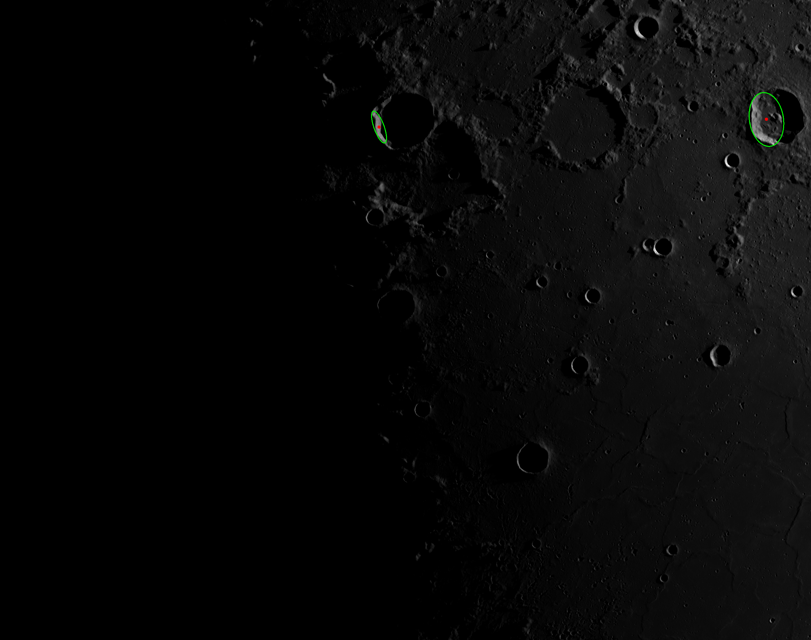

Crater Rim Detection Preprocessing
Problem Statement
Crater rims are vital landmarks for planetary science and navigation. Yet detecting them in real lunar imagery is tough due to:

Shadows hiding rim portions

Lighting variations across the lunar surface

Broken/eroded edges from geological processes

Surface noise from rocks and other craters

This code is the preprocessing step that prepares images and extracts candidate crater features before final ellipse fitting.

Processing Flow
text
RAW IMAGE → ENHANCE → EDGE DETECTION → CONTOUR EXTRACTION → FILTERING → NMS → ELLIPSE FITTING → OUTPUT
Final Results
Below are the detection results after complete processing:

